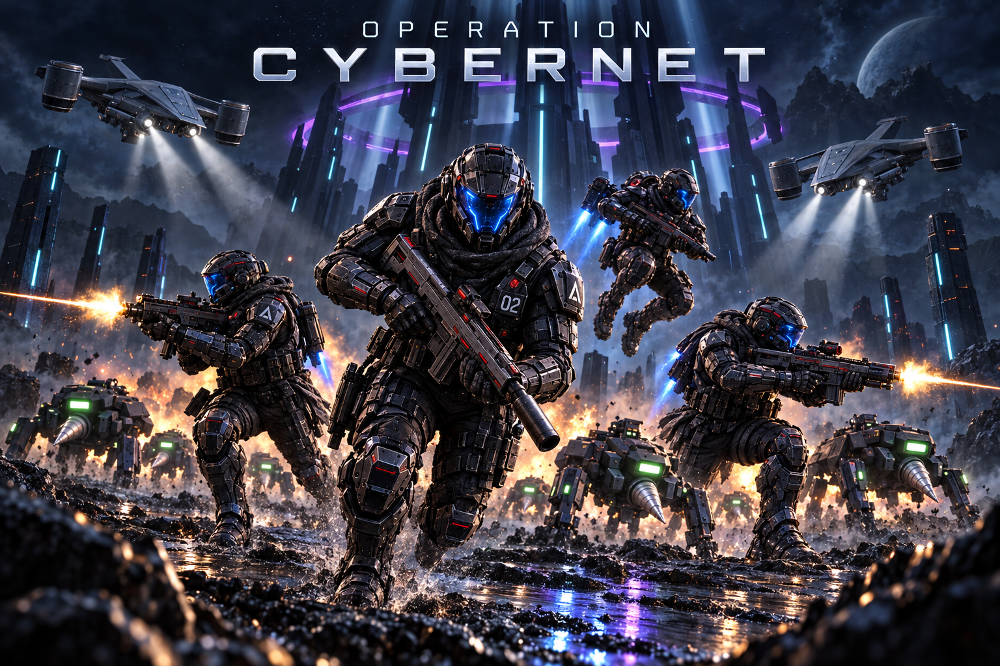
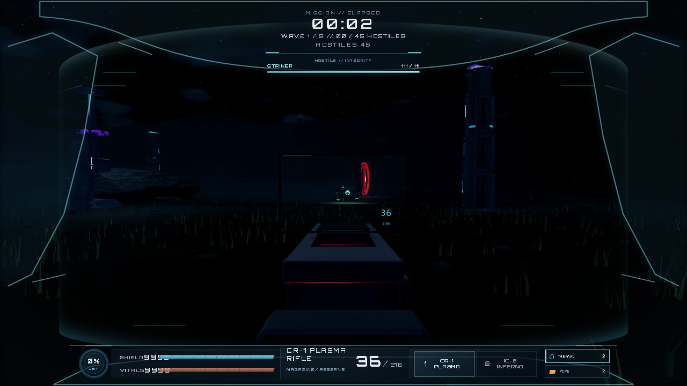
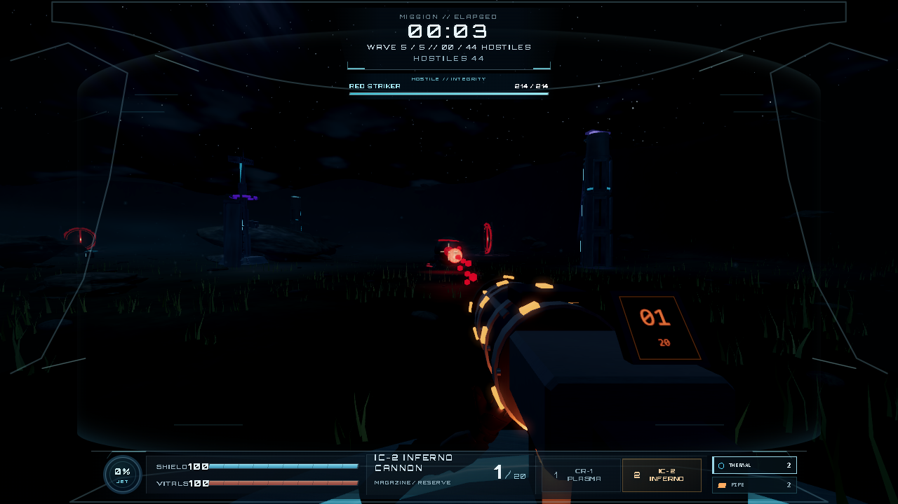

# OPERATION CYBERNET

**Four Operators. One machine uprising.**

A free browser science-fiction arena FPS. Fight beneath an alien temple, boost over machine swarms and face Red Protocol with your fireteam.

*Approved AI-assisted promotional artwork—not a gameplay screenshot.*

## Play free

**[PLAY ON ITCH.IO](https://coltensteelegames.itch.io/operation-cybernet)** · **[FACEBOOK COMMUNITY](https://www.facebook.com/OperationCybernet)**

The itch.io player runs solo. Follow the online server links on the game page for multiplayer; everyone must choose the **same server and room**. Desktop mouse and keyboard recommended. Let initial loading finish before playing.

## Watch the gameplay trailer

**[WATCH THE TRAILER](https://youtu.be/vI4YZ8JotGk) · [PLAY FREE](https://coltensteelegames.itch.io/operation-cybernet)**

Real gameplay from the in-development public playtest. Bring a fireteam and help shape the next build.

## Choose your fight

| Mode | Your mission |
| --- | --- |
| Co-op | Fight together with up to four Operators, including AI helpers. |
| PvP | Take on other Operators in competitive multiplayer. |
| Enemy Survival | Configure the enemy lineup for your own challenge. |
| Single player | Face the machine onslaught solo. |

## Stay mobile. Read the machines.

Jetpack combat and sliding meet plasma weapons, the Inferno cannon and sticky grenades. Striker brings the close-range drill threat; Sentinel hunts overhead. Escalating waves lead into **Red Protocol** and the **Siege Walker**.

## Inside the helmet

Real in-game development captures—not generated artwork. The evolving build may differ from these images.

## Help shape the next build

This is an **active-development public playtest**, not a finished release. Performance and online latency vary by device, location and server.

[Leave feedback on itch.io](https://coltensteelegames.itch.io/operation-cybernet) or [join the Facebook community](https://www.facebook.com/OperationCybernet). Tell us your mode, server, browser, approximate FPS/ping and what happened. Short gameplay clips are welcome; don't share private logs or credentials.

**Which fight made you want another round—and which moment got in the way?**

## Follow the development story

[Read the playable-release devlog](https://coltensteelegames.itch.io/operation-cybernet/devlog/1686025/cybernet-is-now-playable-on-itchio-jetpack-combat-red-protocol-and-four-player-co-op) · [Follow Operation Cybernet](https://www.facebook.com/OperationCybernet)

## Official community and development hubs

- [Discord — find a fireteam and share feedback](https://discord.gg/NXgfDrmpg)
- [Facebook — community news](https://www.facebook.com/OperationCybernet)
- [IndieDB — development stories and machine gallery](https://www.indiedb.com/games/operation-cybernet)
- [Game Jolt — development showcase](https://gamejolt.com/games/operation-cybernet/1103917)

For current play and multiplayer server links, use [the official itch.io page](https://coltensteelegames.itch.io/operation-cybernet).

## About this repository

This is the official **marketing showcase** for Operation Cybernet by Colten Steele Games. It contains play links, approved promotional artwork and gameplay screenshots only. It does not contain the game's source code or server configuration and does not grant an asset-reuse license.

**[ENTER THE PUBLIC PLAYTEST →](https://coltensteelegames.itch.io/operation-cybernet)**

